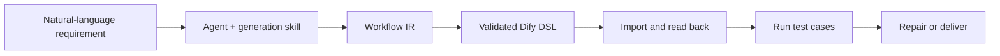

# Dify Workflow MCP

[](https://github.com/MQM233/dify-workflow-mcp/actions/workflows/ci.yml)
[](LICENSE)
[](package.json)

Turn a natural-language workflow idea into a validated, imported, tested Dify Workflow or Chatflow. Dify Workflow MCP gives MCP-capable agents a persistent browser session and 16 tools for DSL generation, canvas-safety validation, app operations, model discovery, draft tests, and knowledge-base setup.

[简体中文](README.zh-CN.md) | English

> Beta: Dify's web-console APIs are not a stable public contract. Pin a release and test against your Dify version before production use.

## Why It Exists

Generating YAML is easy. Producing a workflow that imports, renders on the canvas, uses an available model, survives a realistic run, and reports external blockers honestly is harder. This project closes that loop.



## Features

- Generate strict Workflow IR and render Dify DSL YAML.
- Detect graph, selector, model, and canvas-render hazards before import.
- Reuse one authenticated Chrome/Edge/Chromium profile without repeated browser restarts.
- List apps, models, and knowledge bases in the active Dify workspace.
- Create datasets and index text or local files.
- Import or overwrite a workflow, inspect its draft, run one or many test cases, and roll back test apps.
- Ship reusable generation rules, templates, and examples for Codex, OpenClaw, Claude Code, WorkBuddy, and other MCP clients.
- Separate Dify runtime success from actual business success, especially for blocked web scraping.

## Quick Start

Requirements: Node.js 18+ and Chrome, Edge, or Chromium.

```bash
git clone https://github.com/MQM233/dify-workflow-mcp.git
cd dify-workflow-mcp
npm install
```

Set your deployment URL. A trailing `/apps` is accepted and normalized.

```bash
# macOS/Linux
export DIFY_BASE_URL="https://cloud.dify.ai"

# PowerShell
$env:DIFY_BASE_URL="https://cloud.dify.ai"
```

Add the server to your MCP client:

```json
{
  "mcpServers": {
    "dify-workflow": {
      "command": "node",
      "args": ["/absolute/path/dify-workflow-mcp/src/mcp-server.mjs"],
      "env": {
        "DIFY_BASE_URL": "https://cloud.dify.ai"
      }
    }
  }
}
```

Restart the client, call `dify_login` once, sign in in the opened browser, then call `dify_status`.

For Codex, install the generation skill too:

```powershell
.\scripts\install.ps1 -InstallCodexSkill
```

```bash
./scripts/install.sh --install-codex-skill
```

See [client configuration](docs/client-configuration.md) for other clients and [compatibility](docs/compatibility.md) for tested scope.

## Tool Set

| Area | Tools |
| --- | --- |
| Session | `dify_login`, `dify_status`, `dify_open_app` |
| Discovery | `dify_list_apps`, `dify_list_models`, `dify_list_datasets` |
| Generation | `dify_render_ir`, `dify_validate_dsl` |
| Workflow | `dify_import_dsl`, `dify_get_draft`, `dify_run_draft`, `dify_test_draft`, `dify_delete_app` |
| Knowledge | `dify_create_dataset`, `dify_create_document_by_text`, `dify_create_document_by_file` |

## Security

The server controls a logged-in browser profile and can create or delete Dify resources. Keep the profile directory private, review generated DSL before importing into sensitive workspaces, and use a dedicated test workspace where possible. No cookies or credentials are stored in this repository.

## Development

```bash
npm run check
npm test
npm run validate:examples
npm pack --dry-run
```

Architecture and limitations are documented in [docs/architecture.md](docs/architecture.md). Contributions are welcome; read [CONTRIBUTING.md](CONTRIBUTING.md) first.

## License

Apache License 2.0. See [LICENSE](LICENSE) and [NOTICE](NOTICE).
