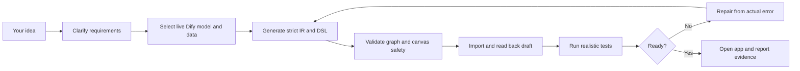

<div align="center">

# Dify Workflow MCP

### Describe the workflow. Let your AI agent build it in Dify, run it, and tell you what actually worked.

**Natural language -> strict DSL -> validation -> import -> draft test -> repair**

[](https://github.com/MQM233/dify-workflow-mcp/stargazers)
[](https://github.com/MQM233/dify-workflow-mcp/releases)
[](https://github.com/MQM233/dify-workflow-mcp/actions/workflows/ci.yml)
[](LICENSE)
[](package.json)

[Quick Start](#quick-start) · [What It Can Build](#what-can-it-build) · [Why This Project](#why-this-project) · [16 MCP Tools](#16-mcp-tools) · [简体中文](README.zh-CN.md)

</div>

---

Most Dify generators stop after writing YAML. Dify Workflow MCP keeps going.

It gives Codex, Claude Code, OpenClaw, WorkBuddy, and other stdio MCP clients the tools and operating rules to turn a short request into a workflow that is **locally validated, imported into Dify, read back from the draft graph, exercised with test cases, and repaired when something fails**.

No Dify backend source code or database access is required. The server works through the Dify web console with a private, persistent browser profile.

## From One Sentence To A Tested Workflow

Ask your agent:

```text
Create a Dify workflow that accepts a GitHub repository URL, reads its README
and repository structure, then returns a concise technical assessment.
Import it, run a normal case and an invalid-URL case, and report the result.
```

The agent can then execute the complete loop:



Instead of only saying `created successfully`, the final result is designed to look like this:

```text
Created and imported: GitHub Project Analyst
App: https://your-dify.example/app/...
Runtime: succeeded
Business result: README and repository tree were retrieved and summarized.
Edge case: invalid URL returned a controlled error message.
Known limitation: private repositories require an authenticated retrieval service.
Artifacts: analysis-github-project.yml, analysis-github-project.cases.json
```

## What Can It Build?

### Resume screening

```text
Build a resume-screening workflow that scores candidates against a job description,
shows evidence for every score, identifies risks, and proposes interview questions.
```

See the tested artifact: [smart-resume-screening.yml](examples/smart-resume-screening.yml)

### Website and repository analysis

```text
Build a workflow that analyzes a GitHub project from its URL. If retrieval is blocked,
accept pasted content as a fallback and say clearly which source the report used.
```

See the artifacts: [analysis-github-project.yml](examples/analysis-github-project.yml) and [test cases](examples/analysis-github-project.cases.json)

### Knowledge-base assistants

```text
Create a knowledge base, upload these policy documents, then build a grounded Q&A
workflow that cites retrieved passages and declines unsupported answers.
```

The MCP can discover existing datasets and models, create a dataset, index text or local files, and connect the resulting IDs to the generated workflow.

Other useful patterns include document review, structured extraction, API orchestration, routing, batch processing, report generation, and file-generation bridges. Start from the bundled [templates](skills/dify-workflow-generation/templates) and [examples](examples).

## Why This Project?

There are excellent Dify template collections and DSL-generation skills. This project focuses on the missing operational half: **making an agent responsible for the result inside Dify, not just the file outside Dify**.

| Capability | Manual canvas | YAML-only generator | Dify Workflow MCP |
| --- | :---: | :---: | :---: |
| Start from a one-line request | No | Yes | Yes |
| Clarify ambiguous requirements | Manual | Agent-dependent | Bundled rule and skill |
| Discover models available in the workspace | Manual | Usually no | Yes |
| Validate graph references and canvas shape | No | Sometimes | Yes |
| Import into Dify automatically | Manual | No | Yes |
| Read the imported draft back | Manual | No | Yes |
| Run positive and edge test cases | Manual | No | Yes |
| Repair from real Dify errors | Manual | No | Agent repair loop |
| Create and populate knowledge bases | Manual | No | Yes |
| Distinguish runtime success from business success | Manual | Rarely | Required delivery rule |
| Roll back temporary apps | Manual | No | Yes |

### Built for the failure modes that matter

- A DSL can import but still crash the Dify canvas. The validator checks node wrappers, dimensions, code bindings, edge metadata, selectors, and other render-sensitive fields.
- A workflow can return `succeeded` while a website returned a login or anti-bot page. The reporting rules separately track runtime status and useful-content retrieval.
- A generated LLM node can reference a model unavailable in your workspace. The agent can call `dify_list_models` before generation.
- Multiple browser launches can lock the same profile. Operations share one context, reuse one page, close redundant blank tabs, and execute through a queue.

## Quick Start

### Let your agent install it

Paste this into an AI coding client that can edit its own MCP configuration:

```text
Install Dify Workflow MCP from https://github.com/MQM233/dify-workflow-mcp for my current client.
Before downloading anything, detect whether Node.js 18+ and Chrome, Edge, or Chromium already exist.
Load rules/universal.md as the project rule. For Codex, also install the bundled
dify-workflow-generation skill; for OpenClaw, also load rules/openclaw.md.
Set DIFY_BASE_URL to my Dify console URL, register the stdio MCP server, restart or reload
the client if needed, then call dify_login and dify_status to verify the connection.
```

### Manual installation

Requirements: Node.js 18+ and an installed Chrome, Edge, or Chromium browser.

```bash
git clone https://github.com/MQM233/dify-workflow-mcp.git
cd dify-workflow-mcp
npm install
```

Add this server entry to your MCP client. Use an absolute path:

```json
{
  "mcpServers": {
    "dify-workflow": {
      "command": "node",
      "args": ["/absolute/path/dify-workflow-mcp/src/mcp-server.mjs"],
      "env": {
        "DIFY_BASE_URL": "https://cloud.dify.ai"
      }
    }
  }
}
```

Restart the client, call `dify_login` once, finish signing in in the opened browser, then call `dify_status`. The login persists in `~/.dify-workflow-mcp/browser-profile` by default.

For Codex, install the generation skill as well:

```powershell
# Windows
.\scripts\install.ps1 -InstallCodexSkill
```

```bash
# macOS/Linux
./scripts/install.sh --install-codex-skill
```

Configuration notes for Codex, OpenClaw, Claude Code, WorkBuddy, and other clients are in [client configuration](docs/client-configuration.md).

## 16 MCP Tools

| Area | Tools | What the agent can do |
| --- | --- | --- |
| Session | `dify_login`, `dify_status`, `dify_open_app` | Authenticate once, inspect connectivity, open or refresh an app |
| Discovery | `dify_list_apps`, `dify_list_models`, `dify_list_datasets` | Ground generation in the current workspace |
| Generation | `dify_render_ir`, `dify_validate_dsl` | Render strict IR and detect structural/canvas hazards |
| Workflow | `dify_import_dsl`, `dify_get_draft`, `dify_run_draft`, `dify_test_draft`, `dify_delete_app` | Import, inspect, test, and roll back |
| Knowledge | `dify_create_dataset`, `dify_create_document_by_text`, `dify_create_document_by_file` | Create and populate Dify knowledge bases |

Selected validation and workflow operations are also available through the bundled `difyctl` CLI for development and debugging.

## What Is Included?

```text
src/        MCP server, Dify browser operations, validator, IR renderer, CLI
skills/     Agent skill, generation rules, quality gates, and templates
rules/      Client-neutral and OpenClaw-specific operating rules
examples/   Importable workflows, strict IR files, and test cases
schemas/    Workflow IR JSON Schema
tests/      Unit tests and a real-browser mock-Dify integration test
docs/       Architecture, compatibility, and client configuration
```

## Compatibility And Boundaries

- Tested in CI on Windows, macOS, and Ubuntu with Node.js 18 and 22.
- Uses standard MCP stdio transport.
- Targets Dify Cloud and self-hosted web consoles; exact console endpoints can vary by Dify version, SSO, proxy, and enabled providers.
- Does not require Dify backend source code, database access, or extracting a reusable login token.
- Uses a private persistent browser profile. Never commit or share that directory.
- Browser automation cannot bypass site authentication, CAPTCHA, or anti-bot controls. A good workflow should expose those limits or offer fallback input.

Read [compatibility](docs/compatibility.md), [architecture](docs/architecture.md), and [security policy](SECURITY.md) before production use.

> **Beta notice:** Dify web-console APIs are not a stable public contract. Pin a release and verify against your target Dify deployment.

## Development

```bash
npm run check
npm run test:all
npm run validate:examples
npm audit
npm pack --dry-run
```

The CI matrix runs syntax checks, unit tests, a real-browser mock-Dify integration test, validation of every public YAML example, and package inspection across six OS/Node combinations.

## Roadmap

- Expand strict IR coverage for branching, iteration, extraction, and document nodes.
- Detect Dify version capabilities before choosing node and endpoint shapes.
- Add public Dify canvas recordings and end-to-end demo workflows.
- Publish an npm package and reproducible no-browser runtime bundles.
- Add policy controls for destructive operations and workflow diffs.

See [ROADMAP.md](ROADMAP.md) and open a [feature request](https://github.com/MQM233/dify-workflow-mcp/issues/new?template=feature_request.yml) before starting a large addition.

## Contributing

Reproducible Dify-version findings, sanitized exports, client setup reports, and new test fixtures are especially useful. Read [CONTRIBUTING.md](CONTRIBUTING.md) before opening a pull request.

If this project saves you from manually rebuilding and retesting Dify workflows, a GitHub Star helps other Dify users find it.

## License

Apache License 2.0. See [LICENSE](LICENSE) and [NOTICE](NOTICE). This is an independent project and is not affiliated with or endorsed by LangGenius, Inc.
