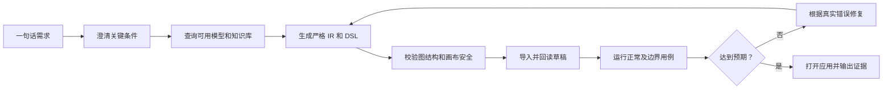

<div align="center">

# Dify Workflow MCP

### 说出你想要的工作流，让 AI 智能体在 Dify 中创建、运行，并告诉你它是否真的有效。

**自然语言需求 -> 严格 DSL -> 本地校验 -> 自动导入 -> 草稿测试 -> 失败修复**

[](https://github.com/MQM233/dify-workflow-mcp/stargazers)
[](https://github.com/MQM233/dify-workflow-mcp/releases)
[](https://github.com/MQM233/dify-workflow-mcp/actions/workflows/ci.yml)
[](LICENSE)
[](package.json)

[快速开始](#快速开始) · [能创建什么](#它能创建什么) · [为什么做这个项目](#为什么做这个项目) · [16 个 MCP 工具](#16-个-mcp-工具) · [English](README.en.md)

</div>

---

多数 Dify 生成工具写完 YAML 就结束了，Dify Workflow MCP 会继续把它做完。

它让 Codex、Claude Code、OpenClaw、WorkBuddy 等支持 stdio MCP 的智能体，可以把一句简短需求变成一个经过**本地校验、自动导入、草稿回读、真实用例测试，并能根据 Dify 错误继续修复**的 Workflow 或 Chatflow。

不需要访问 Dify 后端源码和数据库。MCP Server 通过 Dify Web 控制台工作，并使用独立、持久化的浏览器登录环境。

## 从一句话到经过测试的工作流

你可以直接对智能体说：

```text
创建一个解读 GitHub 项目的 Dify 工作流。用户输入仓库 URL，工作流读取 README
和仓库结构，输出简洁的技术评估。自动导入 Dify，分别测试一个正常 URL 和一个
错误 URL，发现问题就修复，最后告诉我真实测试结果。
```

智能体可以完成整个闭环：



最终结果不会只有一句“创建成功”，而会明确告诉你：

```text
已创建并导入：GitHub 项目解读
应用地址：https://your-dify.example/app/...
运行状态：succeeded
业务结果：成功获取 README 和仓库目录，并生成技术总结。
边界用例：错误 URL 返回了可读的错误提示。
已知限制：私有仓库需要带认证的内容获取服务。
生成文件：analysis-github-project.yml、analysis-github-project.cases.json
```

## 它能创建什么？

### 智能简历筛选

```text
创建一个简历筛选工作流，根据岗位要求进行多维度评分，每项分数必须给出简历证据，
列出风险、信息缺口和面试问题，并保留人工复核建议。
```

查看经过校验的示例：[smart-resume-screening.yml](examples/smart-resume-screening.yml)

### 网页与 GitHub 项目分析

```text
创建一个通过 URL 分析 GitHub 项目的工作流。如果网页抓取受阻，允许用户粘贴正文作为
备用输入，并明确说明最终报告使用的是抓取内容还是用户粘贴内容。
```

查看示例：[analysis-github-project.yml](examples/analysis-github-project.yml) 和 [测试用例](examples/analysis-github-project.cases.json)

### 企业知识库助手

```text
创建一个知识库，上传这些制度文件，再创建一个有引用依据的问答工作流；检索不到答案时
不能编造，需要明确提示资料不足。
```

MCP 可以查询当前工作区已有模型和知识库，创建新的知识库，用文本或本地文件建立索引，再把真实 ID 写入工作流。

项目还适合文档审核、结构化信息提取、API 编排、意图路由、批量处理、报告生成和文件生成桥接等场景。可以直接参考仓库中的 [模板](skills/dify-workflow-generation/templates) 与 [示例](examples)。

## 为什么做这个项目？

GitHub 上已经有优秀的 Dify 工作流模板库和 DSL 生成 Skill。这个项目解决的是缺失的后半段：**让智能体对 Dify 里面最终运行出来的结果负责，而不只是生成一个文件。**

| 能力 | 手动画布编排 | 只生成 YAML | Dify Workflow MCP |
| --- | :---: | :---: | :---: |
| 从一句话需求开始 | 否 | 是 | 是 |
| 需求含糊时主动澄清 | 人工 | 取决于智能体 | 内置规则与 Skill |
| 查询工作区真实可用模型 | 人工 | 通常不能 | 可以 |
| 检查变量引用和画布结构 | 无 | 部分支持 | 可以 |
| 自动导入 Dify | 人工 | 不能 | 可以 |
| 回读导入后的草稿图 | 人工 | 不能 | 可以 |
| 运行正常和边界测试 | 人工 | 不能 | 可以 |
| 根据 Dify 真实错误修复 | 人工 | 不能 | 自动修复循环 |
| 创建并填充知识库 | 人工 | 不能 | 可以 |
| 区分“运行成功”和“业务成功” | 人工判断 | 很少 | 强制交付规则 |
| 删除临时测试应用 | 人工 | 不能 | 可以 |

### 专门处理真正影响使用的问题

- DSL 能导入，不代表画布一定能打开。校验器会检查节点包装、尺寸、代码变量绑定、连线元数据和变量引用等容易导致画布崩溃的结构。
- 工作流显示 `succeeded`，不代表真的抓到了正文。交付规则会分别报告运行状态和实际内容获取结果，避免把登录页、验证码或反爬页面当成分析成功。
- 生成的 LLM 节点可能引用当前工作区没有的模型。智能体可以在生成前调用 `dify_list_models`。
- 多次启动浏览器可能争抢同一个 profile。服务会复用一个浏览器上下文、关闭多余空白页，并串行执行 Dify 操作。

## 快速开始

### 让智能体自动安装

把下面这段话发给能够修改自身 MCP 配置的 AI 编程客户端：

```text
从 https://github.com/MQM233/dify-workflow-mcp 为我当前使用的客户端安装 Dify Workflow MCP。
下载任何依赖前，先检测本机是否已有 Node.js 18+ 和 Chrome、Edge 或 Chromium。
把 rules/universal.md 加载为项目规则；如果当前客户端是 Codex，再安装仓库内的
dify-workflow-generation skill；如果是 OpenClaw，再加载 rules/openclaw.md。
将 DIFY_BASE_URL 设置为我的 Dify 控制台地址，注册 stdio MCP Server；需要时重载客户端，
然后调用 dify_login 和 dify_status 验证连接。
```

### 手动安装

环境要求：Node.js 18+，以及已安装的 Chrome、Edge 或 Chromium。

```bash
git clone https://github.com/MQM233/dify-workflow-mcp.git
cd dify-workflow-mcp
npm install
```

在 MCP 客户端中添加以下配置，并使用绝对路径：

```json
{
  "mcpServers": {
    "dify-workflow": {
      "command": "node",
      "args": ["D:/absolute/path/dify-workflow-mcp/src/mcp-server.mjs"],
      "env": {
        "DIFY_BASE_URL": "https://cloud.dify.ai"
      }
    }
  }
}
```

重启客户端后，首次调用 `dify_login`，在打开的浏览器中完成登录，再调用 `dify_status`。默认登录环境保存在 `~/.dify-workflow-mcp/browser-profile`。

Codex 用户还需要安装工作流生成 Skill：

```powershell
# Windows
.\scripts\install.ps1 -InstallCodexSkill
```

```bash
# macOS/Linux
./scripts/install.sh --install-codex-skill
```

Codex、OpenClaw、Claude Code、WorkBuddy 和其他客户端的配置说明见 [客户端配置](docs/client-configuration.md)。

## 16 个 MCP 工具

| 分类 | 工具 | 智能体可以做什么 |
| --- | --- | --- |
| 登录与页面 | `dify_login`、`dify_status`、`dify_open_app` | 登录一次、检查连接、打开或刷新应用 |
| 环境发现 | `dify_list_apps`、`dify_list_models`、`dify_list_datasets` | 根据当前工作区真实环境进行生成 |
| DSL 生成 | `dify_render_ir`、`dify_validate_dsl` | 由严格 IR 生成 DSL，并发现结构或画布风险 |
| 工作流操作 | `dify_import_dsl`、`dify_get_draft`、`dify_run_draft`、`dify_test_draft`、`dify_delete_app` | 导入、回读、测试和回滚 |
| 知识库 | `dify_create_dataset`、`dify_create_document_by_text`、`dify_create_document_by_file` | 创建知识库并写入文本或文件 |

开发和排错时，也可以通过项目自带的 `difyctl` CLI 调用部分校验和工作流操作。

## 仓库里有什么？

```text
src/        MCP Server、浏览器操作、DSL 校验器、IR 生成器和 CLI
skills/     智能体 Skill、生成规则、质量门槛和模板
rules/      通用规则和 OpenClaw 专用规则
examples/   可导入工作流、严格 IR 和测试用例
schemas/    Workflow IR JSON Schema
tests/      单元测试和真实浏览器 mock-Dify 集成测试
docs/       架构、兼容性和客户端配置说明
```

## 兼容性与边界

- CI 已测试 Windows、macOS、Ubuntu，以及 Node.js 18 和 22。
- 使用标准 MCP stdio 传输。
- 面向 Dify Cloud 和本地化部署的 Web 控制台；实际接口可能受 Dify 版本、SSO、反向代理和已启用模型影响。
- 不需要 Dify 后端源码、数据库权限，也不会提取可复用登录令牌。
- 使用独立的持久化浏览器 profile，不能提交或分享该目录。
- 浏览器自动化不能绕过第三方网站的登录、验证码和反爬机制。工作流应该明确提示限制，或者提供粘贴内容等备用输入。

生产使用前请阅读 [兼容性说明](docs/compatibility.md)、[架构说明](docs/architecture.md) 和 [安全策略](SECURITY.md)。

> **Beta 提示：** Dify Web 控制台接口并不是稳定的公开接口，请固定版本，并在目标 Dify 环境中完成验证。

## 开发验证

```bash
npm run check
npm run test:all
npm run validate:examples
npm audit
npm pack --dry-run
```

CI 会在六种系统与 Node.js 组合中执行语法检查、单元测试、真实浏览器 mock-Dify 集成测试、全部公开 YAML 示例校验和发布包检查。

## 路线图

- 扩展严格 IR 对分支、迭代、参数提取和文档节点的支持。
- 在选择节点和接口结构前自动检测 Dify 版本能力。
- 增加公开 Dify 环境的画布录屏和完整 Demo。
- 发布 npm 包和可复现的无浏览器运行时包。
- 为删除等高风险操作增加策略控制，并支持工作流差异比较。

完整规划见 [ROADMAP.md](ROADMAP.md)。较大的功能建议请先提交 [Feature Request](https://github.com/MQM233/dify-workflow-mcp/issues/new?template=feature_request.yml)。

## 参与贡献

特别欢迎提供可复现的 Dify 版本差异、脱敏后的工作流导出、不同 MCP 客户端的安装结果和新的测试用例。提交 Pull Request 前请先阅读 [CONTRIBUTING.md](CONTRIBUTING.md)。

如果这个项目能帮你省掉反复手工编排和测试 Dify 工作流的时间，点一个 GitHub Star 可以让更多 Dify 用户发现它。

## 开源协议

项目采用 [Apache-2.0](LICENSE) 协议，详见 [NOTICE](NOTICE)。本项目为独立开源项目，与 LangGenius, Inc. 不存在隶属或官方背书关系。
